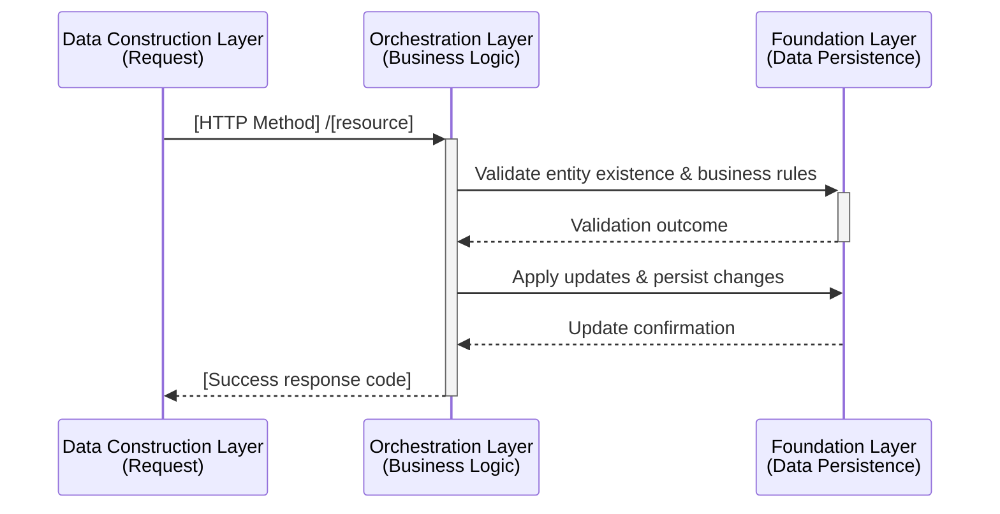
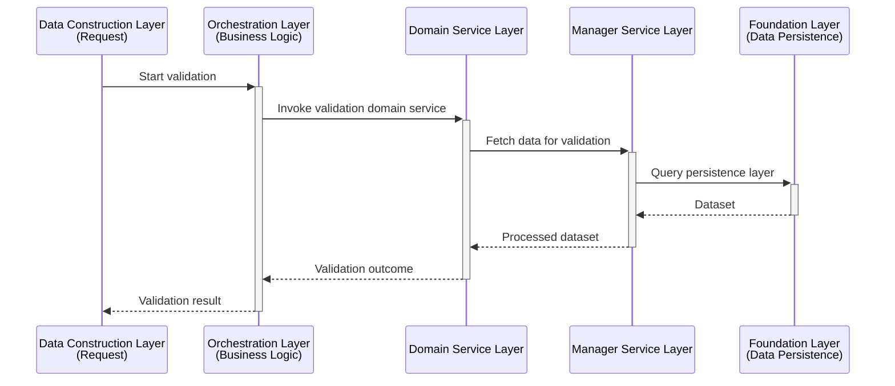
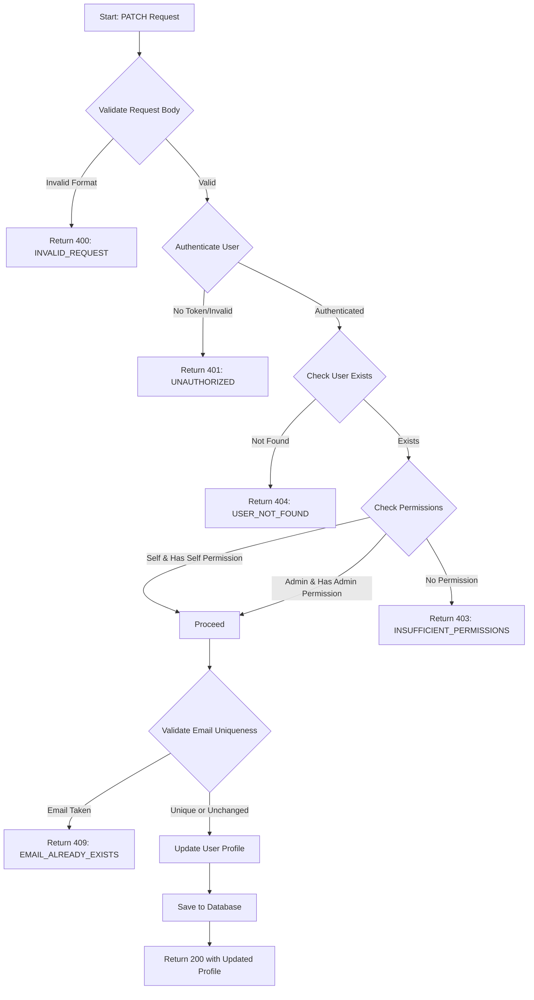

## User Input

```text
$ARGUMENTS
```

You **MUST** consider the user input before proceeding (if not empty).

## Outline

The text the user typed after the API command trigger in the message **is** the API requirement description. Assume you always have it available in this conversation. Do not ask the user to repeat it unless they provided an empty command.

Given that API requirement description, do this:

1. **Parse the API requirement** from the user input to extract:
   - API purpose and functional requirements
   - Expected request/response patterns
   - Authentication and authorization needs
   - Business logic and data flow
   - Success and error scenarios

2. **Determine API file location**:
   - If working within a feature branch (has `.specify/features/[feature-name]/`), create the API spec at:
     - `.specify/features/[feature-name]/specs/api/[api-name].md`
   - If no feature context exists, create at:
     - `.specify/api-specs/[api-name].md`
   - Use kebab-case for file names based on the API's primary purpose

3. **Generate the API specification** using the structure below so the output mirrors production-grade API documents your team already maintains.

## API Specification Template Structure

### Title & Description

```markdown
# API Specification: [API Name]

**Description**: [Single-paragraph summary focused on the business capability.]


```

**Guidelines:**
- Title should follow `# API Specification: ...` and match project naming conventions.
- Provide a concise description (1–2 sentences) describing the scenario this endpoint covers.
- Include a Shields.io badge when a version tag is known (omit the badge if versioning information isn’t supplied).

### Basic Info

```markdown
**URL**: `/v5/orchestration-api/{stage}/person-entities/{peId}/individual`

**Method**: PATCH

**Auth required**: YES

**Permissions required**: `{resource}.{action}`
```

**Guidelines:**
- Always use curly braces for path variables and prefer descriptive names (`{stage}`, `{personEntityId}`).
- Keep the method uppercase and align with REST semantics.
- Permissions should follow the organization’s hierarchical naming scheme.

### Path Variables

```markdown
## Path Variables

| Name | Type | Required | Description | Constraints |
|:-----|:-----|:--------:|:------------|:-------------|
| stage | string | Yes | Deployment stage (dev/test/prod) | Enum: dev, test, prod |
| peId | long | Yes | Person entity identifier | Positive integer |
```

**Guidelines:**
- Use colon-aligned tables (`:---`) for readability.
- Capture precise types (uuid, long, string, ISO date, etc.).
- Constraints should surface formats, enums, ranges, or relationships.

### Request Parameters

```markdown
## Request Parameters

| Field Name | Type | Required | Description | Constraints |
|:-----------|:-----|:--------:|:------------|:-------------|
| userId | long | No | Internal user identifier to associate | BIGINT |
| personEntityShortName | string | No | Display name for the entity | VARCHAR(40) |
| homeAddress | object | No | Residential address block | - |
| &nbsp;&nbsp;&nbsp;&nbsp;└── addressLine1 | string | - | Street line 1 | VARCHAR(500) |
```

**Guidelines:**
- Combine top-level request fields (query/body) into a single table when that matches real specs; otherwise add `### Query Parameters` / `### Headers` subsections before the main table.
- For nested structures, indent child rows with HTML non-breaking spaces (`&nbsp;`) and use the tree glyph (`└──`).
- Constraints should reference actual storage limits or validation rules (lengths, enums, numeric ranges, regex, dependencies).
- If the request surface includes arrays, indicate element structure with `Array` and list child rows beneath it.

### Request Example

Example format:

## Request Example

```json
{
  "userId": "123456",
  "firstName": "John",
  "homeAddress": {
    "addressLine1": "456 Oak Street",
    "city": "Los Angeles",
    "state": "CA",
    "zipCode": "90210"
  }
}
```

**Guidelines:**
- Deliver a realistic JSON example that matches the field table (use true-to-system formats, not toy values).
- Highlight common optional blocks that illustrate nested objects and arrays.

### Response

Example format:

## Response

### Success Response

#### 200 OK

**Content-Type**: `application/json`

```json
{}
```

The API may return an empty object when only the status code signifies success.

### Error Responses

#### 400 Bad Request

```json
{
  "error": {
    "code": "INVALID_REQUEST",
    "message": "Invalid request data",
    "details": [
      {
        "field": "email",
        "issue": "Invalid email format"
      }
    ]
  }
}
```

**Guidelines:**
- Document the primary success status and format (even if empty) and explicitly state when a no-body response (e.g., 204) is expected.
- Provide representative error payloads covering validation, auth, business conflicts, and system failures.
- Add short bullet lists underneath code blocks calling out common causes for each error when helpful.

### Business Workflow

Example format:

## Business Workflow

### High Level Business Workflow Overview

**Description**: [High-level explanation of the orchestration across layers.]



**Process Steps:**

1. **ValidationProcessors** – [Describe validations performed]
2. **BeforeBusinessProcessors** – [Describe data preparation steps]
3. **MainBusinessProcessors** – [Describe core update logic]
4. **AfterBusinessProcessors** – [Describe synchronization and association tasks]
5. **NotificationProcessors** – [Describe webhook/email/logging duties]

**Business Rules:**
- [Rule 1: Description]
- [Rule 2: Description]
- [Rule 3: Description]

**Guidelines:**
- Always model the high-level flow with a `sequenceDiagram` using the `DCL`, `ORC`, and `FS` participants to mirror production documentation.
- Keep the sequence focused on the happy path while naming calls to match the real processor actions (validation, updates, notifications, etc.).
- Follow the diagram with bullet lists for **Process Steps** and **Business Rules** mirroring what engineers expect in downstream specs.

### Processor Details

Use collapsible sections to deep dive into each processor family. When diagrams are necessary, include five participants to reflect orchestration reality (`DCL`, `ORC`, `DS` for domain services, `MGR` for manager services, and `FS` for foundation services).

Example format:

#### ValidationProcessors

<details>
<summary>Click to expand detailed validation flow</summary>



Provide supporting narrative and error codes beneath each diagram as in the production example.

</details>

Repeat the collapsible block for each processor group (`BeforeBusinessProcessors`, `MainBusinessProcessors`, `AfterBusinessProcessors`, `NotificationProcessors`), ensuring the order matches actual runtime sequencing.

### Error Codes

Example format:

## Error Codes

| Error Code | HTTP Status | Description | Cause | Resolution |
|:-----------|:-----------:|:------------|:------|:-----------|
| INVALID_REQUEST | 400 | Request validation failed | Malformed JSON or invalid field values | Correct the payload and retry |

**Guidelines:**
- Keep entries consistent with the error payloads shown earlier.
- Order by typical failure sequence (validation → auth → business → system).
- Split into subsections when numerous codes exist (e.g., “Validation Errors”, “Business Rule Violations”).

### Pseudo Code

Example format:

## Pseudo Code

```pseudo
FUNCTION updateEntity(stage, entityId, requestBody, authContext):
    // Validation phase
    VALIDATE entity exists
    VALIDATE duplicates and business constraints

    // Before business phase
    LOAD existing aggregates and associations

    // Business phase
    APPLY updates across main entity and child collections

    // After business phase
    SYNC downstream systems and associations

    // Notification phase
    QUEUE webhooks and emails

    RETURN success_response(200, null)
END FUNCTION
```

**Guidelines:**
- Mirror the real lifecycle (validation → before business → main business → after business → notifications → logging) so engineers can map pseudo code back to actual processors.
- Capture important branching, retry considerations, and error-handling in comments and helper calls.

## Execution Steps

Follow these steps to generate the API specification:

1. **Analyze the user's API requirement**:
   - Identify the core functionality
   - Determine data inputs and outputs
   - Understand business rules and workflows
   - Identify error scenarios

2. **Determine file location**:
   - Check if in a feature context
   - Create appropriate directory structure if needed
   - Use descriptive, kebab-case file names

3. **Fill each section systematically**:
   - Start with Basic Info (URL, method, auth)
   - Define Path Variables and Request Parameters
   - Design Response structure (success and errors)
   - Create Business Workflow diagram
   - Document Error Codes
   - Write Pseudo Code

4. **Make informed decisions**:
   - Use REST best practices for endpoint design
   - Follow HTTP status code conventions
   - Apply standard authentication/authorization patterns
   - Use common error response structures
   - Follow organizational API conventions if known

5. **Mark clarifications only when critical**:
   - Use [NEEDS CLARIFICATION: question] for critical unknowns
   - Maximum 3 clarification markers
   - Prioritize: security/auth > data structure > business rules
   - Make reasonable assumptions for minor details

6. **Validate completeness**:
   - All sections are filled with concrete details
   - No placeholders remain (except NEEDS CLARIFICATION)
   - Response structure matches request requirements
   - Error cases are comprehensive
   - Business workflow is clear and complete

7. **Report completion**:
   - State the file path where API spec was created
   - List any NEEDS CLARIFICATION items requiring user input
   - Confirm all sections are complete

## Quality Standards

The API specification must meet these standards:

### Clarity
- No ambiguous terms or vague descriptions
- Each field has clear type and purpose
- Validation rules are explicit

### Completeness
- All standard sections present and filled
- Success and error paths documented
- Business rules explicitly stated

### Consistency
- Naming conventions followed throughout
- Error response structure consistent
- HTTP status codes used correctly

### Usability
- Frontend developers can implement API calls from this spec
- Backend developers can implement endpoints from this spec
- QA engineers can write test cases from this spec
- Documentation can be generated from this spec

## Best Practices

### RESTful Design
- Use nouns for resources in URLs
- Use HTTP methods appropriately (GET for read, POST for create, etc.)
- Use plural nouns for collections
- Use HTTP status codes correctly
- Keep URLs clean and intuitive

### Security
- Always specify auth requirements
- Document permission models clearly
- Consider data sensitivity in examples
- Note rate limiting if applicable

### Error Handling
- Provide specific error codes for different scenarios
- Include actionable error messages
- Show example error responses
- Document retry strategies if applicable

### Documentation
- Write for developers who haven't seen the code
- Include examples for complex cases
- Keep response structures flat when possible
- Use consistent terminology

## Example API Spec

Here's an example of a complete API specification following this structure:

**File**: `.specify/features/user-management/specs/api/update-user-profile.md`

```markdown
# API Specification: Update User Profile

## Basic Info

- **URL**: `/api/v1/users/{userId}/profile`
- **Method**: PATCH
- **Auth Required**: YES
- **Permissions Required**: `users.profile.update` or `users.profile.update.self` (if updating own profile)
- **Description**: Updates specific fields of a user's profile information with partial update support.

## Path Variables

| Name | Type | Required | Description | Constraints |
|:-----|:-----|:--------:|:------------|:-------------|
| userId | uuid | Yes | Unique identifier of the user | Valid UUID v4 format |

## Request Parameters

### Headers

| Name | Required | Description | Example |
|:-----|:--------:|:------------|:--------|
| Authorization | Yes | Bearer token for authentication | `Bearer eyJhbGc...` |
| Content-Type | Yes | Request content type | `application/json` |

### Request Body

**Content-Type**: `application/json`

```json
{
  "firstName": "string (optional, user's first name)",
  "lastName": "string (optional, user's last name)",
  "email": "string (optional, user's email address)",
  "phoneNumber": "string (optional, user's phone number)",
  "preferences": {
    "language": "string (optional, UI language)",
    "timezone": "string (optional, user's timezone)"
  }
}
```

**Field Descriptions:**

| Field | Type | Required | Description | Constraints |
|:------|:-----|:--------:|:------------|:------------|
| firstName | string | No | User's first name | 1-50 characters |
| lastName | string | No | User's last name | 1-50 characters |
| email | string | No | User's email address | Valid email format, unique in system |
| phoneNumber | string | No | User's phone number | E.164 format (e.g., +1234567890) |
| preferences | object | No | User preference settings | - |
| preferences.language | string | No | UI language preference | ISO 639-1 code (en, es, fr, etc.) |
| preferences.timezone | string | No | User's timezone | IANA timezone (America/New_York, etc.) |

## Response

### Success Response

#### 200 OK

**Content-Type**: `application/json`

```json
{
  "userId": "uuid",
  "firstName": "string",
  "lastName": "string",
  "email": "string",
  "phoneNumber": "string",
  "preferences": {
    "language": "string",
    "timezone": "string"
  },
  "updatedAt": "ISO8601 timestamp"
}
```

**Field Descriptions:**

| Field | Type | Description |
|:------|:-----|:------------|
| userId | uuid | Unique identifier of the user |
| firstName | string | User's first name |
| lastName | string | User's last name |
| email | string | User's email address |
| phoneNumber | string | User's phone number |
| preferences | object | User preferences |
| updatedAt | string | Timestamp of last update (ISO8601 format) |

### Error Responses

#### 400 Bad Request

```json
{
  "error": {
    "code": "INVALID_REQUEST",
    "message": "Invalid request data",
    "details": [
      {
        "field": "email",
        "issue": "Invalid email format"
      }
    ]
  }
}
```

#### 401 Unauthorized

```json
{
  "error": {
    "code": "UNAUTHORIZED",
    "message": "Authentication required"
  }
}
```

#### 403 Forbidden

```json
{
  "error": {
    "code": "INSUFFICIENT_PERMISSIONS",
    "message": "You don't have permission to update this user's profile"
  }
}
```

#### 404 Not Found

```json
{
  "error": {
    "code": "USER_NOT_FOUND",
    "message": "User with specified ID not found"
  }
}
```

#### 409 Conflict

```json
{
  "error": {
    "code": "EMAIL_ALREADY_EXISTS",
    "message": "Email address is already in use by another user"
  }
}
```

## Business Workflow

**Description**: This API enables users or administrators to update user profile information with validation and authorization checks.



**Process Steps:**

1. **Request Validation**: Validate JSON structure and field formats
2. **Authentication**: Verify bearer token and extract user identity
3. **User Lookup**: Confirm target user exists
4. **Permission Check**: Verify user can update profile (self or admin)
5. **Business Validation**: Check email uniqueness if email is being changed
6. **Update Profile**: Apply partial updates to user profile
7. **Response**: Return updated profile data

**Business Rules:**
- Users can update their own profile with `users.profile.update.self` permission
- Administrators can update any profile with `users.profile.update` permission
- Email addresses must be unique across all users
- Only provided fields are updated (partial update/PATCH semantics)
- Preferences are merged, not replaced entirely

## Error Codes

| Error Code | HTTP Status | Description | Cause | Resolution |
|:-----------|:-----------:|:------------|:------|:-----------|
| INVALID_REQUEST | 400 | Request validation failed | Malformed JSON or invalid field values | Check request format and field constraints |
| UNAUTHORIZED | 401 | Authentication failed | Missing or invalid bearer token | Provide valid authentication token |
| INSUFFICIENT_PERMISSIONS | 403 | User lacks required permissions | User doesn't have permission to update this profile | Request access or update your own profile only |
| USER_NOT_FOUND | 404 | Target user doesn't exist | Invalid userId in path | Verify userId is correct |
| EMAIL_ALREADY_EXISTS | 409 | Email conflict | Email is already used by another user | Choose a different email address |
| INTERNAL_ERROR | 500 | Server error occurred | Unexpected system error | Retry request or contact support |

## Pseudo Code

```pseudo
FUNCTION updateUserProfile(userId, requestBody, authContext):
    // 1. Validate request body structure
    validationErrors = []
    
    IF requestBody.email AND NOT is_valid_email(requestBody.email):
        validationErrors.ADD({"field": "email", "issue": "Invalid email format"})
    
    IF requestBody.phoneNumber AND NOT is_valid_e164(requestBody.phoneNumber):
        validationErrors.ADD({"field": "phoneNumber", "issue": "Invalid phone format"})
    
    IF validationErrors.LENGTH > 0:
        RETURN error_response(400, "INVALID_REQUEST", validationErrors)
    
    // 2. Authenticate (handled by middleware, authContext provided)
    IF NOT authContext.authenticated:
        RETURN error_response(401, "UNAUTHORIZED")
    
    // 3. Fetch target user
    user = database.findUserById(userId)
    IF NOT user:
        RETURN error_response(404, "USER_NOT_FOUND")
    
    // 4. Check permissions
    isSelf = (authContext.userId == userId)
    hasSelfPermission = authContext.hasPermission("users.profile.update.self")
    hasAdminPermission = authContext.hasPermission("users.profile.update")
    
    canUpdate = (isSelf AND hasSelfPermission) OR hasAdminPermission
    
    IF NOT canUpdate:
        RETURN error_response(403, "INSUFFICIENT_PERMISSIONS")
    
    // 5. Validate business rules
    IF requestBody.email AND requestBody.email != user.email:
        emailExists = database.findUserByEmail(requestBody.email)
        IF emailExists:
            RETURN error_response(409, "EMAIL_ALREADY_EXISTS")
    
    // 6. Apply partial updates
    updateData = {}
    
    IF requestBody.firstName:
        updateData.firstName = requestBody.firstName
    
    IF requestBody.lastName:
        updateData.lastName = requestBody.lastName
    
    IF requestBody.email:
        updateData.email = requestBody.email
    
    IF requestBody.phoneNumber:
        updateData.phoneNumber = requestBody.phoneNumber
    
    IF requestBody.preferences:
        // Merge preferences instead of replacing
        updateData.preferences = MERGE(user.preferences, requestBody.preferences)
    
    // 7. Update timestamp
    updateData.updatedAt = NOW()
    
    // 8. Save to database
    TRY:
        updatedUser = database.updateUser(userId, updateData)
        
        // 9. Return success response
        RETURN success_response(200, {
            userId: updatedUser.userId,
            firstName: updatedUser.firstName,
            lastName: updatedUser.lastName,
            email: updatedUser.email,
            phoneNumber: updatedUser.phoneNumber,
            preferences: updatedUser.preferences,
            updatedAt: updatedUser.updatedAt
        })
        
    CATCH DatabaseError AS e:
        LOG.error("Database error updating user profile", e)
        RETURN error_response(500, "INTERNAL_ERROR")

END FUNCTION
```

## Notes

- This command is designed to work standalone or within a feature branch context
- Generated API specs can be used by frontend, backend, and QA teams
- Specifications should be reviewed and approved before implementation
- Consider generating OpenAPI/Swagger specs from these markdown specifications for API documentation tools

