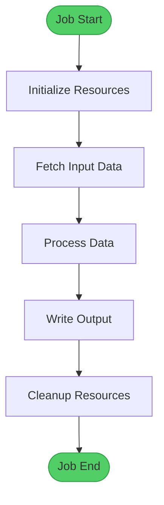

## User Input

```text
$ARGUMENTS
```

You **MUST** consider the user input before proceeding (if not empty).

## Command Purpose

This command performs **deep analysis** of Python job/task code to generate a comprehensive specification document that includes:

1. **Job Basic Information** - Metadata, dependencies, configuration
2. **Business Workflow Analysis** - Visual flowcharts using Mermaid diagrams
3. **Code Quality Assessment** - Issues, bugs, anti-patterns
4. **Architecture Review** - Design patterns, scalability, maintainability
5. **Status Determination Logic** - How job success/failure is determined
6. **Performance Analysis** - Bottlenecks, optimization opportunities
7. **Improvement Recommendations** - Prioritized action items

## Execution Steps

### 1. Locate and Load Job Code

Parse `$ARGUMENTS` to identify the job file:

**Option A - File path provided**:
```
/path/to/job/file.py
relative/path/job.py
```

**Option B - Job name/description**:
```
"Analyze the billing statement intake job"
"Review the user notification job"
```

Search strategy:
- Look for Python files in common job directories: `jobs/`, `tasks/`, `workers/`, `schedulers/`
- Match by filename, class name, or function name
- If multiple matches, ask user to clarify

**Option C - Code pasted inline**:
- User provides the code directly in the message
- Parse and analyze the provided code

### 2. Deep Code Analysis

Perform comprehensive analysis across multiple dimensions:

#### 2.1 Static Code Analysis

**Extract Metadata**:
- File path and module name
- Class/function names and signatures
- Dependencies and imports
- Configuration variables
- Environment variables used

**Identify Entry Points**:
- Main execution method (e.g., `run()`, `execute()`, `main()`)
- Setup/teardown methods
- Error handling blocks

**Map Data Flow**:
- Input sources (SFTP, S3, Database, API, Queue)
- Processing steps
- Output destinations
- External service calls

#### 2.2 Business Logic Analysis

**Workflow Extraction**:
- Sequential processing steps
- Parallel/concurrent operations
- Conditional branches
- Loop iterations
- Retry mechanisms

**Business Rules**:
- Validation logic
- Business constraints
- Data transformation rules
- Decision criteria

**State Management**:
- How job tracks progress
- Checkpoint mechanisms
- Resume capability

#### 2.3 Error Handling Analysis

**Exception Patterns**:
- Which exceptions are caught
- How errors are logged
- Error propagation
- Failure recovery

**Status Determination**:
- Success criteria
- Partial success handling
- Failure conditions
- Status reporting mechanism

#### 2.4 Resource Management

**Connections**:
- Database connections
- SFTP/FTP sessions
- HTTP clients
- Message queue connections

**Resource Cleanup**:
- Context managers usage
- Finally blocks
- Resource leak risks

**Concurrency**:
- Threading patterns
- Multiprocessing usage
- Async/await usage
- Lock mechanisms

### 3. Generate Job Specification Document

Create a comprehensive markdown document with the following structure:

## Job Specification Template

```markdown
# [Job Name] - Business Flow & Analysis

**Document Version**: 1.0  
**Analysis Date**: [YYYY-MM-DD]  
**Job Path**: `[relative/path/to/job.py]`  
**Analyst**: AI Agent via /speckit.job-analysis

---

## 📋 Job Basic Information

### Job Metadata

| Property | Value |
|:---------|:------|
| **Job Name** | [Name extracted from code] |
| **Job Type** | [Scheduled/Triggered/Manual] |
| **Language** | Python [version if detectable] |
| **Framework** | [Airflow/Celery/Custom/etc] |
| **Execution Frequency** | [Daily/Hourly/On-Demand/etc] |
| **Average Duration** | [Estimate based on operations] |
| **Owner/Team** | [If identifiable from code/comments] |

### Dependencies

**External Services**:
- [Service 1: Purpose]
- [Service 2: Purpose]
- [Service N: Purpose]

**Python Packages**:
- [package1==version: Usage]
- [package2==version: Usage]

**Internal Modules**:
- [module.service: Purpose]
- [module.helper: Purpose]

### Configuration

**Environment Variables**:
| Variable | Required | Default | Purpose |
|:---------|:--------:|:--------|:--------|
| [VAR_NAME] | Yes/No | [value] | [Description] |

**Configuration Files**:
- [config.py: Settings defined]
- [settings.yaml: Parameters]

---

## 📊 Business Workflow Analysis

### 1. High-Level Overview

[Brief description of what the job does from a business perspective]



### 2. Detailed Processing Flow

[Detailed explanation of the processing logic]

```mermaid
flowchart TB
    [Generate detailed flowchart showing:
    - All processing steps
    - Decision points with conditions
    - Error paths
    - Retry logic
    - Success/failure outcomes
    
    Use color coding:
    - Green for success paths
    - Red for failure/error paths
    - Yellow for warnings/skip scenarios
    - Blue for parallel processing
    - Gray for not-applicable paths]
```

### 3. Concurrency Model

[If job uses parallel processing]

```mermaid
sequenceDiagram
    participant Main as Main Process
    participant Worker as Worker Process/Thread
    participant Resource as External Resource
    
    [Show interaction between main and worker processes/threads]
```

### 4. Key Business Rules

**Validation Rules**:
1. [Rule 1: Description]
2. [Rule 2: Description]

**Processing Rules**:
1. [Rule 1: Description]
2. [Rule 2: Description]

**Decision Rules**:
1. [Condition → Action]
2. [Condition → Action]

---

## 🚨 Job Status Determination

### Success Criteria

**Current Implementation**:
```python
[Extract actual success determination code]
```

**Analysis**:
- ✅/❌ Does success mean all items processed successfully?
- ✅/❌ Does it allow partial success?
- ✅/❌ Does it check for critical vs. non-critical failures?
- ✅/❌ Does it validate output completeness?

**Success Scenarios**:
| Scenario | Processed | Failed | Success Rate | Current Status | Expected Status |
|:---------|:---------:|:------:|:------------:|:--------------:|:---------------:|
| [Scenario 1] | [N] | [0] | [100%] | [Current] | [Expected] |
| [Scenario 2] | [N] | [Few] | [>95%] | [Current] | [Expected] |
| [Scenario 3] | [N] | [Half] | [~50%] | [Current] | [Expected] |
| [Scenario 4] | [N] | [Most] | [<10%] | [Current] | [Expected] |

### Failure Criteria

**Current Implementation**:
```python
[Extract actual failure determination code]
```

**Failure Triggers**:
1. [Trigger 1: Description]
2. [Trigger 2: Description]

**Failure Reporting**:
- Logging: [How failures are logged]
- Metrics: [If metrics are published]
- Alerts: [If alerts are triggered]
- Reports: [If reports are generated]

---

## 🔴 Critical Issues

[Analyze and document all critical issues found]

### Issue 1: [Issue Title] ⚠️

**Severity**: 🔥 Critical / ⚠️ High / 🟡 Medium / 🔵 Low

**Location**: `lines [X-Y]`

**Problem Description**:
```python
[Extract problematic code snippet]
```

**Root Cause**:
- [Explanation of why this is a problem]
- [Technical details]
- [Business impact]

**Actual Impact**:
```mermaid
[Diagram showing the impact flow]
```

**Consequences**:
- 🔥 [Consequence 1]
- 🔥 [Consequence 2]

**Recommended Fix**:
```python
[Provide improved code example]
```

**Explanation**:
[Explain why the fix works]

---

## 🟡 Architecture & Design Issues

### Design Pattern Analysis

**Current Patterns Detected**:
- [Pattern 1: Where it's used]
- [Pattern 2: Where it's used]

**Anti-Patterns Detected**:
- ❌ [Anti-pattern 1: Description]
- ❌ [Anti-pattern 2: Description]

### SOLID Principles Compliance

| Principle | Compliance | Issues |
|:----------|:----------:|:-------|
| Single Responsibility | ✅/❌ | [Details] |
| Open/Closed | ✅/❌ | [Details] |
| Liskov Substitution | ✅/❌ | [Details] |
| Interface Segregation | ✅/❌ | [Details] |
| Dependency Inversion | ✅/❌ | [Details] |

### Architecture Problems

**Problem 1: [Title]**
- **Issue**: [Description]
- **Impact**: [Business/technical impact]
- **Recommendation**: [How to fix]

---

## 🟠 Code Quality Issues

### Code Smells

**Long Methods**:
| Method | Lines | Recommendation |
|:-------|:-----:|:--------------|
| [method_name] | [count] | [Refactoring suggestion] |

**Complex Methods**:
| Method | Cyclomatic Complexity | Recommendation |
|:-------|:---------------------:|:--------------|
| [method_name] | [number] | [Simplification suggestion] |

**Duplicated Code**:
- [Location 1] and [Location 2]: [Description]

**Magic Numbers/Strings**:
- [Value] at line [X]: Should be [CONSTANT_NAME]

### Error Handling Issues

**Overly Broad Exception Handling**:
```python
[Extract problematic code]
```
- **Problem**: [Explanation]
- **Fix**: [Use specific exceptions]

**Missing Error Handling**:
```python
[Extract code missing error handling]
```
- **Risk**: [Potential failure scenario]
- **Fix**: [Add appropriate error handling]

### Logging Issues

**Incorrect Log Levels**:
| Line | Current Level | Should Be | Reason |
|:----:|:-------------:|:---------:|:-------|
| [N] | [INFO] | [ERROR] | [Operation failure] |
| [N] | [INFO] | [WARNING] | [Data issue] |

---

## ⚡ Performance Issues

### Bottlenecks Identified

**Issue 1: [Title]**
- **Location**: `lines [X-Y]`
- **Problem**: [Description]
- **Impact**: [Performance impact]
- **Optimization**: [Suggestion]

### Resource Usage

**Database Queries**:
- N+1 Query Problem: [Yes/No with examples]
- Missing Indexes: [Potential issues]
- Batch Operations: [Could be optimized]

**Memory Usage**:
- Large Data Loading: [Issues]
- Memory Leaks: [Potential risks]

**I/O Operations**:
- File Operations: [Optimization opportunities]
- Network Calls: [Could be parallelized]

---

## 🔐 Security & Reliability Issues

### Security Concerns

**Hardcoded Credentials**:
- [Location]: [Type of credential]

**SQL Injection Risks**:
- [Location]: [Description]

**Path Traversal Risks**:
- [Location]: [Description]

### Reliability Issues

**Resource Leaks**:
| Resource | Location | Issue |
|:---------|:---------|:------|
| [Type] | [Line] | [Not properly closed] |

**Race Conditions**:
- [Location]: [Description]

**Idempotency**:
- ✅/❌ Is the job idempotent?
- [Analysis]

---

## 📈 Monitoring & Observability

### Current Monitoring

**Logging**:
- ✅/❌ Structured logging
- ✅/❌ Appropriate log levels
- ✅/❌ Contextual information

**Metrics**:
- ✅/❌ Performance metrics
- ✅/❌ Business metrics
- ✅/❌ Error rates

**Alerting**:
- ✅/❌ Failure alerts
- ✅/❌ Performance alerts
- ✅/❌ Business metric alerts

### Recommended Improvements

**Metrics to Add**:
```python
[Example code for adding CloudWatch/DataDog metrics]
```

**Alerting Strategy**:
```yaml
[Example alert configuration]
```

---

## 📋 Improvement Recommendations

### Priority P0 - Critical (Fix Immediately)

| # | Issue | Impact | Recommendation | Effort |
|:-:|:------|:-------|:---------------|:------:|
| 1 | [Issue] | [Impact] | [Action] | [S/M/L] |

### Priority P1 - High (Fix Soon)

| # | Issue | Impact | Recommendation | Effort |
|:-:|:------|:-------|:---------------|:------:|
| 1 | [Issue] | [Impact] | [Action] | [S/M/L] |

### Priority P2 - Medium (Plan to Fix)

| # | Issue | Impact | Recommendation | Effort |
|:-:|:------|:-------|:---------------|:------:|
| 1 | [Issue] | [Impact] | [Action] | [S/M/L] |

### Priority P3 - Low (Nice to Have)

| # | Issue | Impact | Recommendation | Effort |
|:-:|:------|:-------|:---------------|:------:|
| 1 | [Issue] | [Impact] | [Action] | [S/M/L] |

---

## 🎯 Proposed Success Determination Strategy

### Recommended Approach

Choose the most appropriate strategy based on business requirements:

#### Option A: Strict Mode (Zero Tolerance)
```python
def run(self):
    results = self.process_all_items()
    
    stats = self.calculate_statistics(results)
    self.send_report(results)
    
    # Fail if ANY item failed
    if stats['failed_count'] > 0:
        raise JobFailureError(
            f"Job failed: {stats['failed_count']}/{stats['total']} items failed"
        )
```

**Use When**:
- Critical financial operations
- Compliance-required processing
- Small batch sizes

#### Option B: Threshold Mode (Tolerance Allowed)
```python
def run(self):
    results = self.process_all_items()
    
    stats = self.calculate_statistics(results)
    self.send_report(results)
    
    # Fail if success rate below threshold
    SUCCESS_THRESHOLD = 0.95  # 95%
    if stats['success_rate'] < SUCCESS_THRESHOLD:
        raise JobFailureError(
            f"Success rate {stats['success_rate']:.1%} below threshold {SUCCESS_THRESHOLD:.1%}"
        )
```

**Use When**:
- Large batch processing
- Expected occasional failures
- Non-critical data

#### Option C: Severity-Based Mode (Categorized Failures)
```python
def run(self):
    results = self.process_all_items()
    
    critical_failures = [r for r in results if r.is_critical_failure()]
    retriable_failures = [r for r in results if r.is_retriable_failure()]
    
    self.send_report(results)
    
    # Fail only on critical failures
    if critical_failures:
        raise JobFailureError(
            f"{len(critical_failures)} critical failures detected"
        )
    
    # Log retriable failures for monitoring
    if retriable_failures:
        logger.warning(f"{len(retriable_failures)} retriable failures")
```

**Use When**:
- Complex processing with multiple failure types
- Need to distinguish transient vs. permanent failures
- Sophisticated error handling required

---

## 📊 Recommended Metrics

### Business Metrics
```python
def publish_business_metrics(self, results):
    """Publish business-level metrics"""
    metrics = {
        'total_processed': len(results),
        'successful': len([r for r in results if r.success]),
        'failed': len([r for r in results if not r.success]),
        'success_rate': calculate_success_rate(results),
        'processing_time_seconds': self.elapsed_time,
        # Add business-specific metrics
        'total_amount_processed': sum(r.amount for r in results),
        'items_by_type': group_by_type(results)
    }
    
    self.metrics_client.publish(
        namespace='Jobs/[JobName]',
        metrics=metrics,
        dimensions={
            'Environment': os.getenv('ENVIRONMENT'),
            'JobName': self.__class__.__name__
        }
    )
```

### Technical Metrics
```python
def publish_technical_metrics(self):
    """Publish technical metrics"""
    metrics = {
        'database_query_count': self.db_query_count,
        'database_query_time_ms': self.db_query_time,
        'external_api_calls': self.api_call_count,
        'external_api_time_ms': self.api_call_time,
        'memory_usage_mb': get_memory_usage(),
        'cpu_usage_percent': get_cpu_usage()
    }
    
    self.metrics_client.publish(
        namespace='Jobs/[JobName]/Performance',
        metrics=metrics
    )
```

---

## 🧪 Testing Recommendations

### Unit Tests Needed

**Critical Paths**:
1. Test [method_name] with [scenario]
2. Test [method_name] with [edge_case]

**Error Handling**:
1. Test behavior when [external_service] fails
2. Test behavior with invalid input data

### Integration Tests Needed

**End-to-End Scenarios**:
1. [Scenario 1: Description]
2. [Scenario 2: Description]

---

## 📚 Documentation Needs

### Missing Documentation

- [ ] Architecture overview diagram
- [ ] Data flow documentation
- [ ] Error handling strategy
- [ ] Runbook for operational issues
- [ ] Configuration guide
- [ ] Troubleshooting guide

---

## ✅ Checklist for Production Readiness

### Code Quality
- [ ] All critical issues resolved
- [ ] Code review completed
- [ ] Unit tests added (>80% coverage)
- [ ] Integration tests added

### Monitoring
- [ ] Metrics implemented
- [ ] Alerts configured
- [ ] Dashboards created
- [ ] Logging enhanced

### Operations
- [ ] Runbook created
- [ ] On-call procedures documented
- [ ] Rollback plan defined
- [ ] Load testing completed

### Security
- [ ] Security review completed
- [ ] Credentials externalized
- [ ] Input validation added
- [ ] Error messages sanitized

---

## 📝 Summary

### Current State
- [Summarize current problems]
- [Key risks]

### Desired State
- [What should be achieved]
- [Expected outcomes]

### Next Steps
1. [Immediate action 1]
2. [Immediate action 2]
3. [Immediate action 3]

---

**Document Maintenance**: This analysis should be updated when significant code changes occur.

**Analysis Confidence**: [High/Medium/Low] - Based on code completeness and clarity

**Estimated Improvement Effort**: [X person-days/weeks]

```

---

## Analysis Principles

### 1. Be Thorough But Practical
- Focus on real, actionable issues
- Prioritize by business impact
- Provide concrete examples
- Include code snippets

### 2. Use Visual Diagrams
- Create Mermaid flowcharts for complex logic
- Use sequence diagrams for interactions
- Add state diagrams for status transitions
- Color-code for clarity (green=success, red=error, yellow=warning)

### 3. Be Objective
- Base findings on code evidence
- Distinguish facts from opinions
- Provide rationale for recommendations
- Consider trade-offs

### 4. Think Like an Engineer
- Consider production scenarios
- Think about edge cases
- Analyze failure modes
- Evaluate operational impacts

### 5. Be Constructive
- Not just problems, but solutions
- Include code examples for fixes
- Explain the "why" behind recommendations
- Prioritize improvements realistically

---

## Output Guidelines

### File Naming
- Create file at: `.specify/job-analysis/[job-name]-analysis.md`
- Or if in feature: `.specify/features/[feature]/job-analysis/[job-name]-analysis.md`
- Use kebab-case for filenames

### Markdown Quality
- Use proper heading hierarchy
- Format code blocks with language tags
- Use tables for structured data
- Include syntax-valid Mermaid diagrams
- Add color coding for visual clarity

### Completeness Check
Before finishing, verify:
- [ ] All sections filled with concrete details
- [ ] At least 3 Mermaid diagrams included
- [ ] All code issues have line numbers
- [ ] All recommendations have priorities
- [ ] Success criteria clearly defined
- [ ] Metrics examples provided

---

## Notes

- This command performs **static analysis** - it analyzes code structure, not runtime behavior
- Analysis quality depends on code quality and completeness
- Some issues may require domain knowledge to fully assess
- Recommendations should be validated with the team
- Consider business context when prioritizing fixes
- This is a living document - update as code evolves


